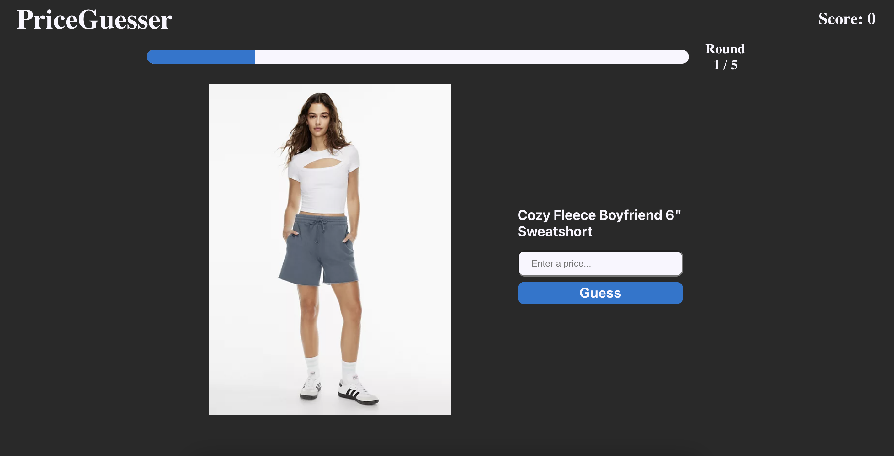
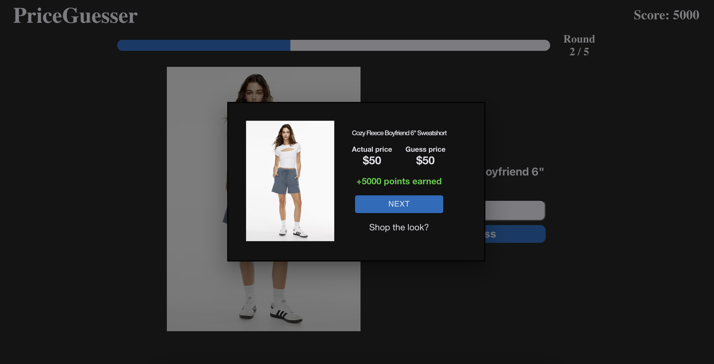

# PriceGuesser

> PriceGuesser allows players to guess the price of five items. The closer the guess is to the actual price, the more points are earned. Try to beat your high score!

## Table of Contents
* [General Info](#general-information)
* [Technologies Used](#technologies-used)
* [Screenshots](#screenshots)
* [Setup](#setup)
* [Usage](#usage)
* [Project Status](#project-status)
* [Room for Improvement](#room-for-improvement)
* [Contact](#contact)
<!-- * [License](#license) -->

## General Information
- PriceGuesser is spinoff of the popular web game GeoGuesser. Players have five round to guess the price of a given piece of clothing from fast fashion. The closer the guess is to the actual price the more points a player will score for that given round. After five round the total points are added up for the final score. Try it today!
- This project gave me experience with frontend web development, backend RESTful-APIs, UX/UI design and implementation, web-scraping in python, database operations, and much more! 

## Technologies Used
- ReactJS - version 18.2.0
- Flask - version 2.2.2
- JSON Web Token (JWT) - version 8.5.1
- ExpressJS - version 4.18.1
- Material UI - version 5.8.2
- Axios - version 0.27.2
- BeautifulSoup - version 4.11.1

## Screenshots

<!-- If you have screenshots you'd like to share, include them here. -->

## Setup
The project is not currently hosted on a server. Use the following steps to run it in a local env.

1) Clone this repository
2) You will have to create a MongoDB account and connect it to the application
3) Add images in MongoDB in structure of a collection named development -> items
4) Go to the terminal and type `cd frontend` and `npm install`
5) Similarly with the backend type `cd ..`, `cd backend`, and `npm install`
6) Run the server.py file
7) Type `cd ..`, `cd frontend`, and `npm start`

## Project Status
Project is: Almost complete, finishing touches are still remaining...

## Room for Improvement

Room for improvement:
- UI/UX can definitely be improved in the next iteration

To do:
- More items need to be added to the database
- Add User Management (keep track of high scores, public leaderboard)
- Add different game modes (free mode)

## Acknowledgements
- This project was inspired by a TikTok

## Contact
Created by [@ahadk770] - feel free to contact me!
